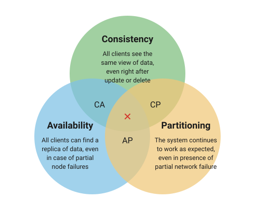

# CAP Theorem

<a class="watch-video" href="https://www.youtube.com/watch?v=BHqjEjzAicA">&#9654;&nbsp;Watch Video</a>

The CAP theorem states that it is not possible to guarantee all three of the desirable properties – consistency, availability, and partition tolerance at the same time in a distributed system with data replication.

The theorem states that networked shared-data systems can only strongly support two of the following three properties:

<figure markdown="span">
  
</figure>

### Consistency:

Consistency means that the nodes will have the same copies of a replicated data item visible for various transactions. A guarantee that every node in a distributed cluster returns the same, most recent and a successful write. Consistency refers to every client having the same view of the data. There are various types of consistency models. Consistency in CAP refers to sequential consistency, a very strong form of consistency.

### Availability:

Availability means that each read or write request for a data item will either be processed successfully or will receive a message that the operation cannot be completed. Every non-failing node returns a response for all the read and write requests in a reasonable amount of time. The key word here is "every". In simple terms, every node (on either side of a network partition) must be able to respond in a reasonable amount of time.

### Partition Tolerance:

Partition tolerance means that the system can continue operating even if the network connecting the nodes has a fault that results in two or more partitions, where the nodes in each partition can only communicate among each other. That means, the system continues to function and upholds its consistency guarantees in spite of network partitions. Network partitions are a fact of life. Distributed systems guaranteeing partition tolerance can gracefully recover from partitions once the partition heals.
