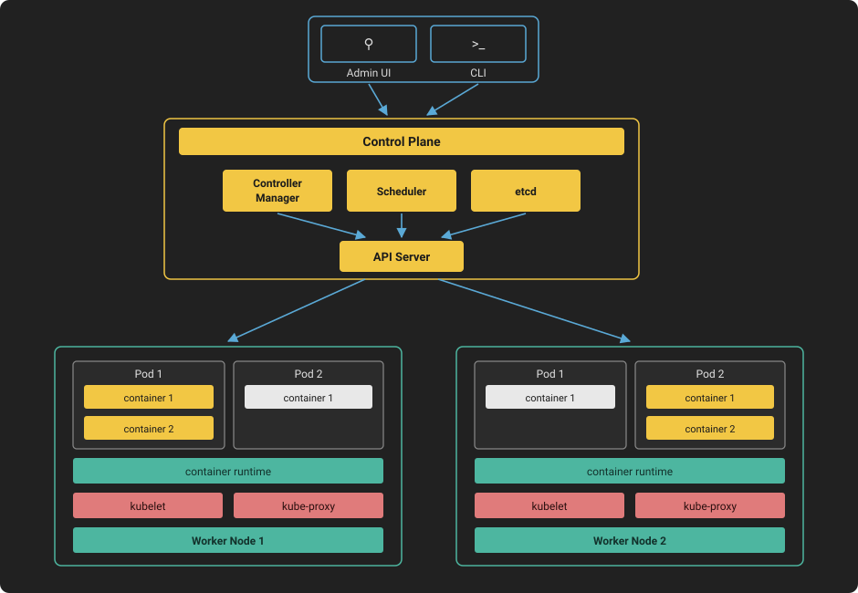

# Kubernetes

<a class="watch-video" href="https://www.youtube.com/watch?v=TlHvYWVUZyc">&#9654;&nbsp;Watch Video</a>

Kubernetes is an open-source container orchestration platform designed to automate the deployment, scaling, and management of containerized applications. It is central to the video's theme as it explains the origin, functionality, and components of Kubernetes. The script mentions Kubernetes' roots in Google's Borg system and its evolution into an open-source project, highlighting its significance in modern application management.

Kubernetes Architecture:

<figure markdown="span">
  
</figure>

### What is Kubernetes?

Kubernetes is an open-source container orchestration platform that automates the deployment, scaling, and management of containerized applications.

### Why is Kubernetes abbreviated as 'k8s'?

The abbreviation 'k8s' comes from the 8 letters between the 'k' and the 's' in the word 'Kubernetes', following a common practice in tech to abbreviate long words.

### What is the origin of Kubernetes?

Kubernetes originated from Google's internal container orchestration system called Borg, which was open-sourced in 2014.

### What are the two core components of a Kubernetes cluster?

The two core components of a Kubernetes cluster are the control plane, responsible for managing the state of the cluster, and the worker nodes, which run the containerized application workloads.

### What is the role of the control plane in a Kubernetes cluster?

The control plane is responsible for managing the state of the cluster, including the API server, etcd, scheduler, and controller manager, which handle various aspects of cluster management.

### What are Pods in Kubernetes?

Pods are the smallest deployable units in Kubernetes, hosting one or more containers and providing shared storage and networking for those containers.

### What is the function of the scheduler in the control plane?

The scheduler is responsible for scheduling pods onto the worker nodes in the cluster, making placement decisions based on the resources required by the pods and the available resources on the worker nodes.

### What are the main components that run on the worker nodes in Kubernetes?

The main components running on the worker nodes include kubelet, container runtime, and kube-proxy, which handle communication with the control plane, container operations, and network routing, respectively.

### Why is Kubernetes considered scalable and highly available?

Kubernetes is scalable and highly available due to features like self-healing, automatic rollbacks, and horizontal scaling, allowing applications to scale up and down quickly in response to demand changes.

### What are the downsides of using Kubernetes?

The downsides of using Kubernetes include its complexity in setup and operation, which requires a high level of expertise and resources, and the cost associated with running the system to support its features.

### What is a managed Kubernetes service and how does it benefit organizations?

A managed Kubernetes service is provided by cloud providers like Amazon EKS, GKE on Google Cloud, and AKS on Azure. It allows organizations to run Kubernetes applications without managing the underlying infrastructure, handling tasks that require deep expertise.

### Takeaways

- 📚 Kubernetes is an open-source container orchestration platform that automates the deployment, scaling, and management of containerized applications.

- 🔍 It originated from Google's internal system, Borg, and was open-sourced in 2014, which is why it's called Kubernetes.

- 🤓 The abbreviation 'k8s' comes from the 8 letters between the 'k' and 's' in Kubernetes, similar to 'i18n' for internationalization.

- 🌐 A Kubernetes cluster consists of nodes that run containerized applications, with a control plane managing the cluster's state.

- 🛠 The control plane includes core components like the API server, etcd, scheduler, and controller manager, each with specific responsibilities.

- 📦 Pods are the smallest deployable units in Kubernetes, hosting one or more containers and providing shared storage and networking.

- 🔄 The scheduler in Kubernetes is responsible for efficiently placing pods onto worker nodes based on resource requirements.

- 🛑 The controller manager runs controllers that maintain the desired state of the cluster, including replication and deployment controllers.

- 🔧 Worker nodes contain components like kubelet, container runtime, and kube-proxy, which manage pod execution and network traffic.

- ⚖️ Kubernetes offers scalability, high availability, self-healing, and portability, making it adaptable to various infrastructures.

- 💡 The complexity and cost of setting up and managing Kubernetes can be mitigated by using managed Kubernetes services provided by cloud providers.

- ❗ For smaller organizations, the principle of YAGNI (You ain’t gonna need it) may apply, suggesting that Kubernetes might be overkill for their needs.
